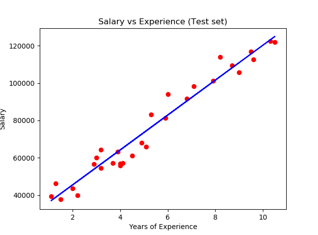
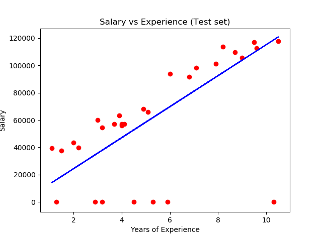

# WHO AM I
My name is Mamadou Cisse, three years ago while serving on active duty at a remote location one had an epiphany regarding the direction the world is heading. At some point technology will be integrated into everything and humans will become more dependent on technological advancement more than ever. It was at this moment that one had the vison of becoming a contributor in tech and not just a consumer. From there, one enrolled into Southern New Hampshire University (SNHU) Computer Science program to pursuit a bachelor’s degree. The journey is nearing a checkpoint, one has to say it has been a phenomenal experience. One went from writing ‘_Hello world!_’ to fully functional applications and employed as a SQL Server Engineer. Below are examples of some of the important concepts that was learned during this experience and how one has progress through the years. 

# ASSESSMENT
As a student at SNHU, one concentrated on Software Engineering (SE). Problem solving and building things has always been an area of interest. One is driven by forward-momentum, what this means is that one is constantly looking forward to the next challenge. In the context of SE, one is obsessed with the finding ways to improve current projects, finding better solutions, no matter how small. The questions “_what can I do to make it better?_” searching for this answer is what fuel one’s drive. There is always a room for improvement when it comes to software. 

The program at SNHU from the very first day challenged one to improve one’s skills, approach and view on problem solving methods. As result, one now writes and design codes that are up to industry standard. This can bee seen in the codes that accompany this portfolio. One has worked on multiple projects outside the classroom. However, with skills gained from the classroom, one has the capability to improve previously built project. Which can also be seen in the accompany code. This program has help solidify one’s strength, skill and most importantly a broaden one’s understanding of what SE is. Concepts such as collaboration and security are often overlooked. One is fully aware of the importance of these concepts as they were emphasized throughout the coursework. 

To demonstrate one’s understanding, I’d like to reference CS 310, “_Collaboration & Team Project_”.  A course fully dedicated to collaboration using Bitbucket. With over 15 students all working on the same repository and implementing their choice of music into the code. One also had the option to review other students code and discuss what could be change or simply ask questions for clarification. C++ is one’s strongest language. while it offers performance advantages, it’s easy to introduce security flaw in one’s code if things are misused. C++ Pointers is a topic I spend lots of time on. They are powerful yet, subject to causing unauthorized memory access that can lead to other problems. Throughout the coursework, one has invested time in areas such as code design, databases, data structure and algorithms, reviewing requirements from stakeholders. Time spend in these areas during the program as shape one’s professional goal and has prepared one for the challenges ahead. 

# ARTIFACTS
The artifacts that are presented here are to showcase one’s skill and one’s growth throughout the program. While the artifacts focus and put emphasize the following areas: Software Design and Engineering, Data Structure and Algorithms, Database. That not to say that other areas were ignore. Security in particular has been taking into full consideration in all the artifacts and could not be emphasize enough. These areas are implemented in every application out there and its important that one has done work in these areas as a preparation to what’s to come. Below one will find a summary of the artifact and the work that was done. In addition, the code/project can be downloaded for review. 

# Design
The artifact used to demonstrate one’s understanding of design is titled “_AccountApp_”. This is a project that initially began outside the classroom back in March 2019. After a while one revisited the project and the room for improvement was huge. This gave one the opportunity to incorporate the project into classroom work. The project is  a simple program that implement object oriented programming inherence concept  by using an account which is a base class and saving account, checking account and trust account  which are all derived classes. Users perform basic operation such as deposit, withdraw and display balance. The initial design of this project is extremely poor, but one was not aware of this at the time. Although the code is functional, everything is cramped in a single main.ccp file, which makes the code difficult to maintain, reused, and difficult to read and dissect.  

To improve the design of the project, one implemented new skills learned throughout the program such as making use of header files, hide majority of the code and make reference call. This truncated the main.ccp file and it looks cleaner. The readability is off the chart, and the code can easily be modified and reused. Both the original and enhance code are provided for download.
### Link To project
[AccountApp](AccountApp.zip)

# Data Structure and Algorithms
The artifact used here to demonstrate this concept is part of the Account application that was mentioned above. However, there is a separate downloadable for the code, one did not include the entire project but, simply the methods where the concepts were implemented. Initially the project was design with arrays of accounts. Upon later review, one realized that the project can be improved given the limitation of arrays. One, arrays fixed in size. While this is not an issue now, in an event where one needs space for more accounts then what’s allocated, one would have to go back to the source code and change the max size and recompile the code. This too costly and could be avoided.

As a method of improvement, one modified the code to use vectors as the data type, which is a dynamic array with lots of cool functions. This improved the artifact by avoiding the allocation of unnecessary storage space, the accounts can grow and shrink in size at runtime and it gives the ability to use methods that provide bounds checking. This allow one to delete some of the code that was being used for tracking number of accounts It’s important to keep in mind that this is in context of C++. Other modern languages would not experience this issue with arrays. With similar semantics and syntax for array and vectors, the changes were still challenging to implement. It important to understand the limitations and advantages of what’s in one’s code. Kindly download the project.
### Link To project
[DataStructure](DataStructures.zip)

# Databases
Data is by far the most valuable assets at most companies, beside the employees of course. One is not referencing any particular database platform here, although one has done database administration task using Microsoft SQL Server. One is more interested in the data themselves and how businesses are leveraging it to make data-driven decisions. For that reason, one has decided to demonstrate skills in building simple Machine Learning models using python to help predict trends base on given dataset. 

In a previous course where one did data analysis using Microsoft Excel and JUMP software, there were limitations that was not addressed. One was handling missing data points from the dataset. This has a negative impact on results. One revisited those datasets with new tools and attempt to improve the outcome. The dataset describes the annual salary of an employees at startups based on years of experience. One would think that the more experience the more the earnings, but the world we live in is not perfect.

The improvement method was to use Python and its powerful libraries design to deal with the limitations mentioned above. As a result, the regression model that one build had a much smaller percent error compared to the outcome of JUMP software, This can be seen in the figures that are provide with the python code and the dataset. As a data junkie, the enhancement process was very informative. Although not include in the downloadable, the same analysis was done using R. Outcomes were the same, most importantly it was an opportunity to learn another widely used program. Kindly download the project _LinearRegression._
### Link To project
[DataStructure](https://github.com/mc27249/mc27249/blob/master/Linear%20Regression.zip)

### New Model

### Previous Model

